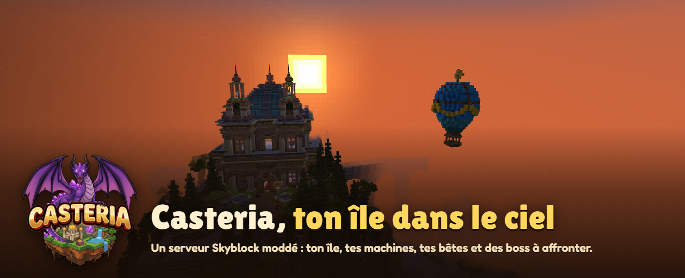
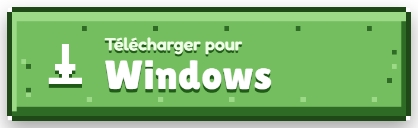
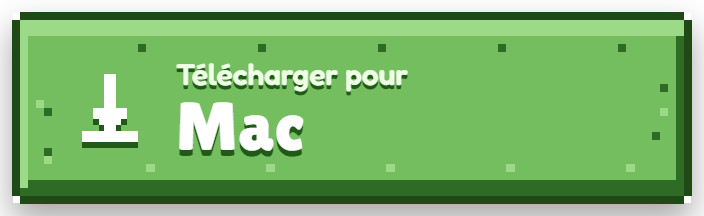
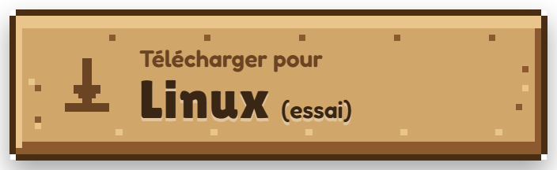
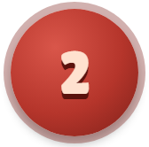
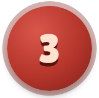
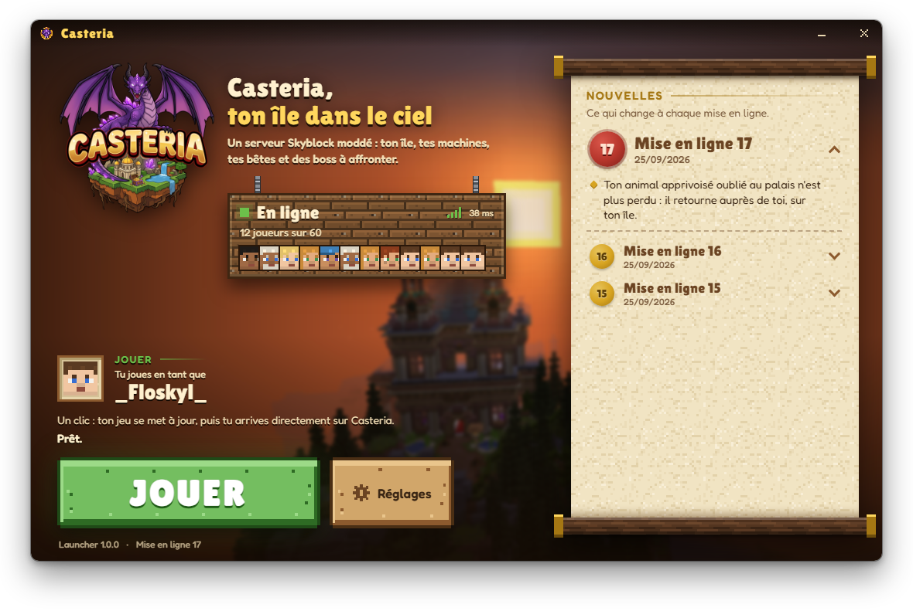
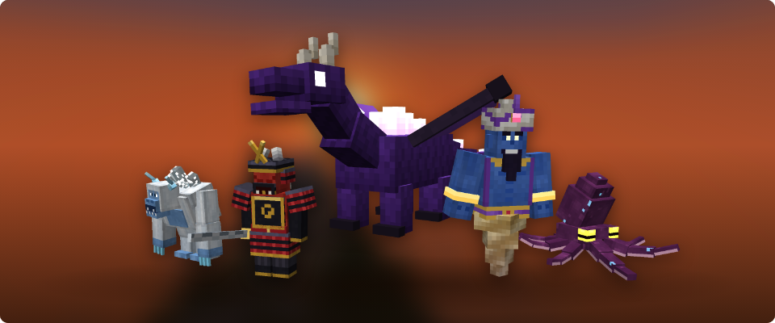

  

  
  
  

  
    Mac : <a href="https://github.com/guerrinflorian/casteria-mc/releases/download/installateur/Casteria-mac-apple-silicon.zip">puce Apple (M1, M2, M3...)</a>
    ou <a href="https://github.com/guerrinflorian/casteria-mc/releases/download/installateur/Casteria-mac-intel.zip">processeur Intel</a>
     Linux : <a href="https://github.com/guerrinflorian/casteria-mc/releases/tag/installateur">choisis ton fichier sur la page d'installation</a>
     <a href="https://github.com/guerrinflorian/casteria-mc/releases/tag/installateur">L'aide pour installer, système par système</a>
  

 

## Jouer en 3 étapes

<table>
  <tr>
    <td width="76" align="center"></td>
    <td><b>Télécharge le launcher</b> Clique sur le bouton de ton ordinateur, juste au-dessus : Windows, Mac ou Linux.</td>
  </tr>
  <tr>
    <td width="76" align="center"></td>
    <td><b>Installe-le</b> Sur Windows, ouvre le fichier : le launcher s'installe tout seul et s'ouvre. Si Windows affiche un écran bleu, clique sur <b>Informations complémentaires</b>, puis <b>Exécuter quand même</b> : c'est normal pour un nouveau programme. Sur Mac et Linux, <a href="https://github.com/guerrinflorian/casteria-mc/releases/tag/installateur">la page d'installation</a> te montre chaque étape.</td>
  </tr>
  <tr>
    <td width="76" align="center"></td>
    <td><b>Joue</b> Choisis ton pseudo et clique sur <b>JOUER</b>. Le launcher prépare le jeu (quelques minutes la première fois), puis t'emmène directement sur le serveur. En jeu, la première fois, tape <code>/register</code> puis un mot de passe que tu inventes (4 lettres ou chiffres au moins). Invente-le rien que pour Casteria : jamais celui de ton compte Microsoft ou de ta boîte mail. Les fois suivantes, tape <code>/login</code> puis ce mot de passe. Tu as une minute pour le faire. Mot de passe oublié ? Demande au staff (Discord ou ticket sur le site de Casteria).</td>
  </tr>
</table>

 

## Le launcher

  

Il met ton jeu à jour tout seul, te montre qui joue en ce moment et ce qui change à chaque mise à jour du serveur, puis t'emmène directement sur Casteria.

- **Il ne touche jamais à ton dossier Minecraft habituel** : tu peux garder ton autre launcher.
- **Il ne te demande jamais ton mot de passe** : tu le tapes dans le jeu.
- **Il se met à jour tout seul** : tu n'as rien à retélécharger.
- **Garde toujours le même pseudo, avec les mêmes majuscules** : ton île et tes jetons sont à ce nom.

 

## Des boss à affronter

  

Le Chevalier Noir, le Yéti des Glaces, l'Oni Samouraï, le Djinn des Sables et le Kraken des Abysses. Chaque boss a son arène et ses propres attaques.

 

## Si ça ne marche pas

**Windows bloque le fichier** (écran bleu « Windows a protégé votre ordinateur ») : clique sur **Informations
complémentaires**, puis sur **Exécuter quand même**. C'est normal pour un nouveau programme.

**La première préparation est longue** : la première fois, le launcher télécharge le jeu. Ça peut prendre quelques
minutes, selon ta connexion internet. Ne ferme pas le launcher.

**« Le serveur redémarre ou s'est arrêté. Réessaie dans une minute. »** : attends une minute, puis clique encore sur
**JOUER**.

**Ton île a disparu** : tu as sûrement changé une majuscule de ton pseudo. Remets exactement ton ancien pseudo dans
**Réglages** : ton île revient.

**Mot de passe oublié** : demande au staff (Discord ou ticket sur le site de Casteria).

Un autre souci ? Toutes les solutions, et ce que veut dire chaque message du launcher, sont sur
**[la page d'installation](https://github.com/guerrinflorian/casteria-mc/releases/tag/installateur)**. Rien n'y
correspond ? Contacte un membre du staff sur Discord, ou fais un ticket sur le site de Casteria : dis quel ordinateur tu as, et recopie la phrase que le launcher a écrite.

 

<b>Jouer sans le launcher</b>

 

Tu préfères ton launcher habituel ? Il te faut Minecraft **1.21.1** avec **NeoForge 21.1.251**, et tous les mods du serveur, à leur
dernière version : demande le paquet des joueurs au staff (Discord ou ticket sur le site de Casteria).

L'adresse du serveur : `gm52-dc02.ouiheberg.com:25681`

Le launcher de Casteria reste le plus simple : il fait tout ça tout seul, et garde tes mods à jour à chaque mise à jour du
serveur.

 

  
    Les autres pages de téléchargement de ce dépôt servent au launcher : il y prend tout seul ce dont il a besoin. Tu n'as
    rien à y télécharger à la main. 
    Casteria n'est pas un produit officiel de Minecraft : il n'est ni approuvé par Mojang ou Microsoft, ni lié à eux.
  

